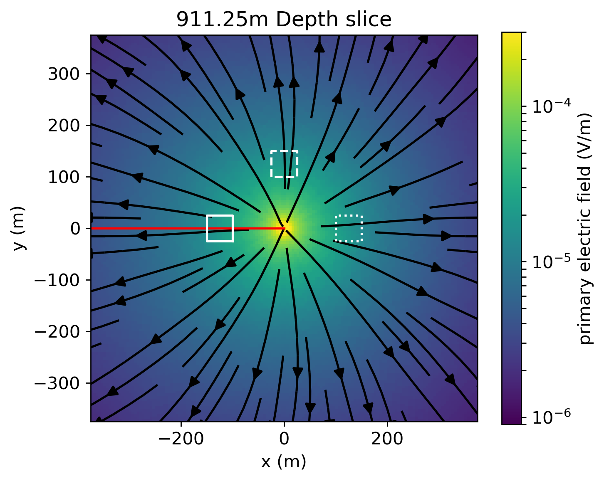

# Direct current resistivity with steel-cased wells

_Lindsey J. Heagy and Douglas W. Oldenburg_

https://doi.org/10.1093/gji/ggz281



## Summary 

The work in this paper is motivated by the increasing use of electrical and electromagnetic methods in geoscience problems where steel-cased wells are present. Applications of interest include monitoring carbon capture and storage and hydraulic fracturing operations. Also of interest is detecting flaws or breaks in degrading steel-casings -- such wells pose serious environmental hazards. The general principles of electrical methods with steel-cased wells are understood and several authors have demonstrated that the presence of steel-cased wells can be beneficial for detecting signal due to targets at depth. However, the success of a DC resistivity survey lies in the details. Secondary signals might only be a few percent of the primary signal. In designing a survey, the geometry of the source and receivers, and whether the source is at the top of the casing, inside of it, or beneath the casing will impact measured responses. Also  the physical properties and geometry of the background geology, target, and casing will have a large impact on the measured data. Because of the small values of the diagnostic signals, it is important to understand the detailed physics of the problem and also to be able to carry out accurate simulations. This latter task is computationally challenging because of the extreme geometry of the wells, which extend kilometers in depth but have millimeter variations in the radial direction, and the extreme variation in the electrical conductivity which is typically 5-7 orders of magnitude larger than that of the  background geology.

In this paper, we adopt a cylindrical discretization for numerical simulations to investigate three important aspects of DC resistivity in settings with steel-cased wells. (1) We examine the feasibility of using a surface-based DC resistivity survey for diagnosing impairments along a well in a casing integrity experiment. This parameter study demonstrates the impact of the background conductivity, the conductivity of the casing, the depth of the flaw, and the proportion of the casing circumference that is compromised on amplitude of the secondary electric fields measured at the surface. (2) Next, we consider elements of survey design for exciting a conductive or resistive target at depth. We show that conductive targets generate stronger secondary responses than resistive targets, and that having an electrical connection between the target and well can significantly increase the measured secondary responses. (3) Finally, we examine common strategies for approximating the fine-scale structure of a steel cased well with a coarse-scale representation to reduce computational load. We show that for DC resistivity experiments, the product of the conductivity and the cross-sectional area of the casing is the important quantity for controlling the distribution of currents and charges along its length.

To promote insight into the physics, we present results by plotting the currents, charges, and electric fields in each of the scenarios examined. All of the examples shown in this paper are built on open-source software and are available as Jupyter notebooks.

# Citation

Lindsey J Heagy, Douglas W Oldenburg, Direct current resistivity with steel-cased wells, Geophysical Journal International, Volume 219, Issue 1, October 2019, Pages 1–26, https://doi.org/10.1093/gji/ggz281

```
@article{heagy_direct_2019,
	title = {Direct current resistivity with steel-cased wells},
	volume = {219},
	issn = {0956-540X},
	url = {https://doi.org/10.1093/gji/ggz281},
	doi = {10.1093/gji/ggz281},
	number = {1},
	urldate = {2019-06-18},
	journal = {Geophysical Journal International},
	author = {Heagy, Lindsey J. and Oldenburg, Douglas W.},
	month = {06},
	year = {2019},
	pages = {1-26},
}
```
